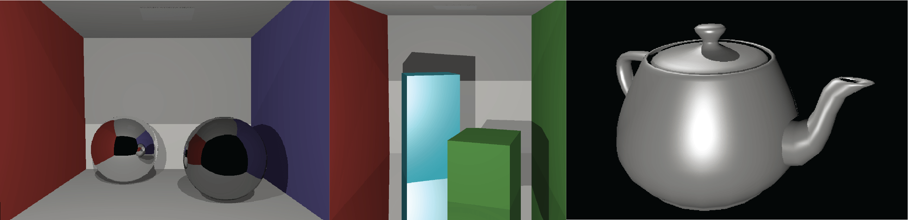

Hello world this is just an example on pagination.
[How to make pizza]()

Lorem ipsum dolor sit amet, consectetur adipiscing elit. Vivamus vehicula blandit turpis, et vulputate velit ornare nec. Cras quis vestibulum est. Nullam ut diam aliquet purus ultricies blandit ut sit amet velit. Integer hendrerit, nibh at aliquet ornare, quam quam consequat lacus, et iaculis nunc neque eu tellus. Maecenas eget metus vel mauris mattis ultrices ut sit amet eros. Suspendisse gravida mauris eget ipsum congue semper. Vestibulum nec ipsum aliquam, hendrerit nisl eget, rhoncus enim. Nulla facilisi. In eu quam orci. Morbi consectetur, velit gravida maximus tristique, nunc purus semper neque, vel semper erat erat quis lacus. Sed venenatis orci eget sapien iaculis, id bibendum velit porttitor. Vestibulum gravida finibus congue. Cras dictum id ligula at laoreet. Interdum et malesuada fames ac ante ipsum primis in faucibus. Nunc tristique accumsan faucibus.

<!-- more -->

Maecenas lobortis tristique magna, et pellentesque leo fermentum ac. Maecenas in justo sit amet felis consectetur tempus non sed nulla. Aliquam aliquet sapien ligula, at blandit metus dignissim sed. Aenean mattis, turpis et blandit eleifend, mi leo fringilla felis, et scelerisque ante metus vitae leo. Nam non nisi mauris. Integer consectetur tempor ante vitae mattis. Pellentesque in convallis est. Vestibulum ullamcorper, ipsum vel porta interdum, nisi augue pulvinar nisl, at malesuada nulla turpis sed mauris. Vivamus sem nulla, tristique vel libero id, facilisis ornare ipsum. Aliquam erat volutpat. Aenean molestie urna turpis, non sodales augue scelerisque et. Orci varius natoque penatibus et magnis dis parturient montes, nascetur ridiculus mus. Donec rutrum lectus leo, egestas convallis leo efficitur et.

Vestibulum pellentesque et lorem eleifend placerat. Maecenas eu nisi ac risus maximus dignissim. Pellentesque non dignissim est. Vestibulum eget nibh nibh. Cras vulputate vehicula ipsum, eu congue mauris scelerisque in. Maecenas non dictum mauris. Vestibulum ante ipsum primis in faucibus orci luctus et ultrices posuere cubilia curae; Quisque tempus purus in lacinia bibendum. Morbi cursus fermentum elit non volutpat. Cras eget tempus sapien. Sed pharetra ex ac nunc ornare, sit amet accumsan sem condimentum. Mauris scelerisque massa eu dui tincidunt mattis. Curabitur erat dolor, lacinia eu viverra sed, faucibus quis elit.

