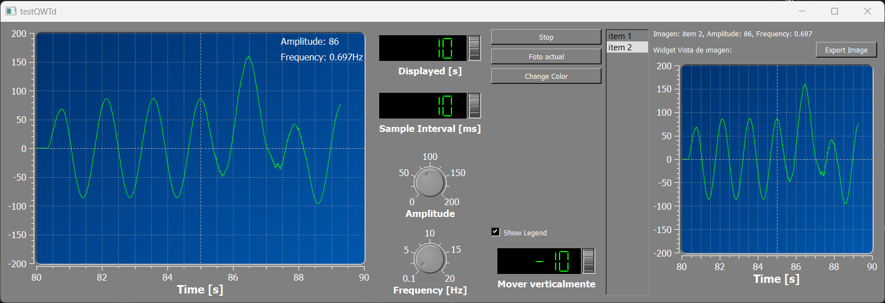
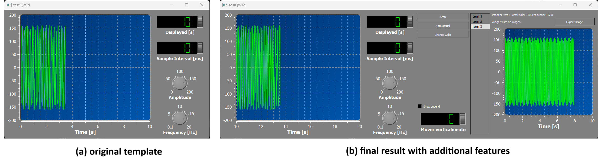

This project was based on the Qt oscilloscope [example](https://doc.qt.io/qt-6/qtcharts-qmloscilloscope-example.html), but a slightly different version (much older, I guess) which is available [here](https://github.com/ex/qwt). Starting with that template, I gradually added new functionalities. These included a 'Stop' button, a 'Change Color' button to modify the curve color, a checkbox labeled 'Legend' to display amplitude and frequency within the plot, a wheel for vertical displacement of the curve, and a 'Foto actual' button to take a screenshot and capture the current state of the plot. All of these features were integrated into a new window layout. Additionally, the project allows exporting the screenshot through a 'Save image' button. This project was part of a programming exam, and I decided to put it here because it was interesting to play with UI programming and the Qt library for the first time. Everything was made with C++ and Qt 5 (If it sounds old to you, the self-containing template came with that version). Despite using an older version, I learned and experimented from the Qt 6 documentation.

<!-- more -->

## Features

I added six new functionalities to the current template. Here, I will list the six features and try to explain what I did to successfully accomplish each task. Is it important to notice that I will omit some details to keep the length of this description, but the codebase of this project can be found [here](https://github.com/paoloMaldonado/qwt_transmin_solved).  

### The "extra" layout

The original template consists of a continuous periodic signal plot. To the right, there is a layout with wheels that allow the modification of the amplitude and the frequency of the plot, as well as a wheel that allows changing the interval length. I added a new vertical layout (QVBoxLayout) to the right of the existing one. This new layout consists of 3 buttons (QPushButton), one checkbox (QCheckBox), and one wheel. In the image below, I show the original program as it comes with the template, and the "extended" version with the new layout:

Below is how I created this new layout and added the buttons to it:


d_stopButton = new QPushButton("Stop", this);

d_photoButton = new QPushButton("Foto actual", this);

d_colorButton = new QPushButton("Change Color", this);

d_legendButton = new QCheckBox("Show Legend", this);

d_verticalDisplWheel = new WheelBox("Mover verticalmente", -100.0, 100.0, 5.0, this);
d_verticalDisplWheel->setValue(0.0);

QVBoxLayout* vLayout2 = new QVBoxLayout();
vLayout2->addWidget( d_stopButton );
vLayout2->addWidget(d_photoButton);
vLayout2->addWidget(d_colorButton);
vLayout2->addStretch(10);
vLayout2->addWidget(d_legendButton);
vLayout2->addWidget(d_verticalDisplWheel);


One the `vLayout2` is complete, I added it to the main layout of the window which was a horizontal layout:


layout->addLayout( vLayout2 );


### The "Stop" button

The "Stop" button stops the time. What does that mean? Well, the plot is periodic or recurrent (and resembles a sine wave), so the plot is rendered infinitely until the application exits where the x-axis corresponds to the time. With this new button, now the plot no longer renders, and the application is still running. A `SamplingThread` object was in charge of the plot generation, but this works as a kind of "backend" of the plot because it still needs to be drawn on the screen, and for that, the `Plot` class exists. `Plot` employs a `Canvas` object inside that renders the signal onto the screen. This `Plot` is also in charge of the interval updates in the x-axis (starting \[0-10\] then incrementing by 10), so I needed to stop not only the "backend" sampling signal but also the interval updating process of the `Plot`. To do so, I implemented a slot called `stopIntervalUpdate()` in the Plot class, which later was going to be connected with the `pressed()` signal of the "Stop" QPushButton. I did the same for the sampling signal object, connecting the `pressed()` signal to the `stop()` slot of the `SamplingThread`.


// connectiong the "Stop" button signal to the Plot slot for stopping the interval updating process.
connect(d_stopButton, SIGNAL( pressed() ), d_plot, SLOT( stopIntervalUpdate() ) );

// connecting the "Stop" button signal to the SamplingThread Slot called stop()
window.connect( &window, SIGNAL( stopButtonPressed() ), &samplingThread, SLOT( stop() ) );


Above is the code but, why are they looking different? the first `connect() `was written in the `MainWindow` class, which holds all the widgets of the application including the plot, the buttons and the layouts. I decided to write almost every new functionality inside that class because is easier to access to attributes such as the Plot or the layouts. The second `connect()` was written in the main file, where a `MainWindow` and a `SamplingThread` object were instantiated, so I could access easily to the `SamplingThread::stop()` slot and created a new signal `MainWindow::stopButtonPressed()` that could be accesed as a public method from any instance of `MainWindow`. 


connect(d_stopButton, SIGNAL( pressed() ), SIGNAL( stopButtonPressed() ) );


Above, I'm connecting two signals. What this actually means is that I'm cloning the `pressed()` signal into the new `stopButtonPressed()` signal, but the functionality remains the same. The `d_stopButton` variable was private, so using its `pressed()` signal outside the `MainWindow` class would not be allowed. On the other hand, `d_plot` was also private, as well as `d_stopButton` (both attributes of MainWindow), so I thought it was a better option if I do the connection inside the` MainWindow` constructor, and I did it in that way.

### The "Foto actual" button

"Foto actual" means "current photo" in English. What I wanted to achieve with this button was to take a screenshot of the plot and store it in a list (a QListWidget). Each screenshot will be given a name such as "item 1," "item 2," etc., corresponding to the order in which they are captured. Each item not only stores the plot image but also the frequency and the amplitude of the signal. Additionally, when the user clicks on any item within the list, a new window layout pops up showing all the data.

This one was the most challenging feature to implement because I needed to find a way to reset the layout that contains the screenshot data. That is, each time the user clicks on any item 'n', the layout appears. Then, when the user clicks on another item, the layout needs to reset and show the data related to the currently selected item. Initially, I thought that adding a new layout each time the user clicks an item could work, but this approach resulted in adding multiple layouts to the main window instead of replacing the existing one (sadly, not what I wanted). This is what I did to accomplish the task: 

Before diving into the real deal of this feature, I added a new QListWidget to the main window. This widget is shown permanent, so when the program starts, the user only will see a little blank vertical space which will be filled with items every time the user clicks on the photo button. Here I'm creating the layout and adding it to the main window. 


d_itemList = new RecordList(this); // Item list
d_itemList->updateGeometry();

layout->addWidget( d_itemList );


Above in the code, `RecordList` is a custom class that inherits from QListWidget, I did it in this way because the constructor of RecordList also handles the visual style of the list box as well as its size within the main window, so I guess I just wanted to be a little bit more organized and not throwing all the code into the `MainWindow` class. 

Next, I implemented two slots in the MainWindow class: `MainWindow::handlePhotoButtonPressed()` and `MainWindow::handleItemSelected()`. The former stores all the necessary data related to the plot, including frequency, amplitude, name, and the screenshot itself, while the latter is designed to handle the event when an item is selected in the list. This slot's role is to create a new layout that visually displays the stored data. Additionally, it ensures that this layout is reset each time a new item is selected by the user, allowing for a fluid transition between different items.

This is the `MainWindow::handlePhotoButtonPressed()`:


void MainWindow::handlePhotoButtonPressed()
{
    double currentAmplitude = this->amplitude();
    double currentFrequency = this->frequency();

    QListWidgetItem* item = new QListWidgetItem("item " + QString::number(++itemCounter), d_itemList);
    item->setData(Qt::UserRole, currentAmplitude);
    item->setData(Qt::UserRole+1, currentFrequency); 
    item->setData(Qt::UserRole+2, d_plotForCapture->grab());

    d_itemList->addItem(item);
}


In the code above, I stored the desired data into the item using QListWidgetItem::setData() and the enum Qt::UserRole for custom data. The amplitude and the frequency were stored as a double while the screenshot as a QPixMap which is the dafault return data type of the QWidget::grab() method. Then I add the item to the list. I should clarify that this Slot is performed right when the photo button is pressed, capturing and storing the state of the plot at that specific moment into the item. This ensures that the data stored in the item accurately reflects the state of the plot at the time of capture.

This is the MainWindow::handleItemSelected() slot function:


void MainWindow::handleItemSelected(QListWidgetItem* item)
{
    // remove the layout (if exists)
    if (currentItemDataLayout)
    {
        layout->removeItem(currentItemDataLayout);
      
        QLayoutItem* child;
        while ((child = currentItemDataLayout->takeAt(0)) != nullptr) {
            delete child->widget(); // delete the widget
            delete child;           // delete the layout item
        }
    }

    // create a new grid layout
    QGridLayout* newItemDataLayout = new QGridLayout();

    // extract the data from the item selected
    QString item_name = item->text();
    QString amplitude = QString::number(item->data(Qt::UserRole).toDouble());
    QString frequency = QString::number(item->data(Qt::UserRole + 1).toDouble());

    QLabel* data_text = new QLabel("Imagen: "    + item_name + ", " + 
                                   "Amplitude: " + amplitude + ", " + 
                                   "Frequency: " + frequency);

    QLabel* text_screenshot = new QLabel("Widget Vista de imagen:");

    QLabel* screenshot = new QLabel();
    d_imageGrabbed = item->data(Qt::UserRole + 2).value<QPixmap>();
    screenshot->setPixmap(d_imageGrabbed);

    QPushButton* d_exportScreenButton = new QPushButton("Export Image");

    // this empty widget helps for positioning all the widgets to the top of the window
    QWidget* empty = new QWidget();
    empty->setSizePolicy(QSizePolicy::Preferred, QSizePolicy::Expanding);

    // adding all the widgets to the grid layout
    newItemDataLayout->addWidget(data_text, 0, 0);
    newItemDataLayout->addWidget(text_screenshot, 1, 0);
    newItemDataLayout->addWidget(d_exportScreenButton, 1, 1);
    newItemDataLayout->addWidget(screenshot, 2, 0, 1, 2);
    newItemDataLayout->addWidget(empty);

    // add the newly created grid layout to the main layout of the program
    layout->addLayout(newItemDataLayout);
    
    // set the newly created grid layout to the current layout 
    // this is neccesary because I want to delete the layout when I select a different item
    currentItemDataLayout = newItemDataLayout;

    // connecting the export screenshot button to the slot that handles the save image action 
    connect(d_exportScreenButton, SIGNAL( pressed() ),
            this, SLOT( handleExportButtonPressed() ) );
}


I begin by checking if the layout that holds the data of the selected item already exists. If it does, I remove this layout from the main window and delete all the widgets within it. The layout that holds the item data is a `QGridLayout` because I wanted to organize everything into columns and rows; using a horizontal layout would not be as convenient, I believe. 

Next, I extract the data from the selected item. The method receives one argument, which is the item selected by the user. All the data is displayed using a `QLabel` object; even the screenshot is first read from the item and then passed to a `QLabel` for display. 

Finally, the new `QGridLayout` is set to be the current layout. So, when the user selects a new item, the slot will delete the current layout and replace it with another newly created QGridLayout containing the new data.

The last `connect()` function corresponds to the 'save image' button, which exports the screenshot.

Here are the `connect()` functions for the photo button and the `RecordList` object. The `QListWidget` class has a QListWidget::itemPressed(QListWidgetItem\* ) signal, which I connected into my `MainWindow::handleItemSelected(QListWidgetItem*)` slot.


connect(d_photoButton, SIGNAL( pressed() ),
        this, SLOT( handlePhotoButtonPressed() ) );
connect(d_itemList, SIGNAL( itemPressed(QListWidgetItem* ) ),
        this, SLOT( handleItemSelected(QListWidgetItem* ) ) );


